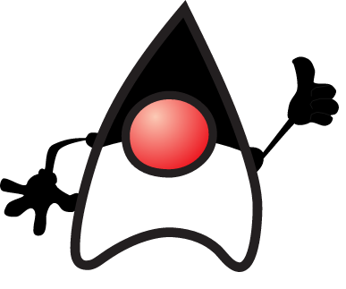

## Desafio - Developer Frontend

Não é esperado que todos consigam realizar esse desafio por completo pois  é destinado a todos os níveis de carreira.

Você será avaliado pela sua capacidade de escrever um código simples, limpo, de fácil manutenção, e pela quantidade de funcionalidades que você entregar.

### Instruções

- **Nome do Projeto:** Controle de tarefas
- **Objetivo do Projeto:** Criar uma aplicação WEB capaz de gerenciar os usuários e as tarefas destes usuários.
- **Tecnologia:** React
- **Entregáveis:** Crie um repositório pessoal para esse projeto, siga as instruções abaixo e então envie um e-mail para selecao@unosolucoes.com.br informando o link do repositório.

### Desafio

- Sua aplicação deverá ser capaz de:
    - Listar todos os usuários
    - Cadastrar novos usuários
    - Listar os dados de um usuário
    - Alterar os dados um usuário
    - Excluir um usuário
    - Listar todas as tarefas de um usuário
    - Criar um tarefa de um usuário
    - Alterar um tarefa de um usuário
    - Exlcuir um tarefa de um usuário

- O cadastro do usuário precisa ter os seguintes campos:
    - Foto do usuário
    - Nome do usuário
    - Cargo do usuário
    - Endereço do usuário
    - Horários de trabalho do usuário (ex.: De Segunda à Sexta das 09h as 18h).
    
- O cadastro de tarefas do usuário precisa ter os seguintes campos:
    - descricao da tarefa
    - tempo estimado da tarefa em horas e minutos
    - Categoria do tarefa (ex.: Manutenção, Desenvolvimento, Suporte.)
    - Situacao da Tarefa (Ex.: Aberta, Em andamento, Fechada)

##### Formato de horários
- É necessário tratar os campos que indicam horários. 
- Os campos devem possuir o formato `HH:mm`.
    - Ex. 1 - para sete horas da manhã, deve ser exibito 07:00
    - Ex. 2 - para sete horas da noite deve ser exibido 19:00

### O que nós vamos avaliar

- Você será avaliado pela qualidade do código, legibilidade e pela quantidade de funcionalidades implementadas.
- Você é livre para tomar as decisões técnicas com as quais você se sente mais confortável. Apenas esteja pronto para explicar as razões que fundamentaram suas escolhas =]
- Inclua um arquivo *README* que possua:
  - desafios/problemas com os quais você se deparou durante a execução do projeto.
  - maneiras através das quais você pode melhorar a aplicação, seja em performance, estrutura ou padrões. 
  - todas as intruções necessárias para que qualquer pessoa consiga rodar sua aplicação sem maiores problemas.

### Dicas

- Documente seu projeto em arquivos markdown ( https://pt.wikipedia.org/wiki/Markdown ) explicando a estrutura, processo de setup e requisitos.
- Tenha sempre a usabilidade, escalabilidade e colaboração.
- A organização das branches e os commits no repositório falam muito sobre como você organiza seu trabalho.
- Os testes unitários são mais do que desejados.
- O design/estrutura do código da aplicação deve ser *production ready*.
- Tenha em mente os conceitos de *SOLID, KISS, YAGNI e DRY*.
- Use boas práticas de programação.

### FAQ

#### Posso utilizar frameworks/bibliotecas?

Sim. Sinta-se a vontade para escolher o que voce conhece melhor.

#### Quanto tempo eu tenho ?

Esperamos que você gaste de 3 a 5 dias.  Mas se precisar de mais tempo não tem problema. Não tente "reinventar a roda".

### React ou angular?

Este desafio é necessário usar **React**.

### Referencias:

#### GIT

* https://www.youtube.com/playlist?list=PLQCmSnNFVYnRdgxOC_ufH58NxlmM6VYd1

### Happy coding 

